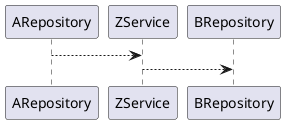
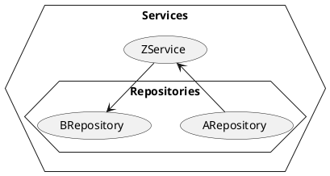

~~We start this tale, with a story: "Add a retry mechanism to call XYZ", the approach that the team wanted to take was to just use the `@Retry` annotation from Spring Framework. should be as easy as adding the annotation on top of the method signature.~~

When we started writing the test to accomplish this, we started simple `@Autowire` this, write the test. run the test. Then:

```
Error creating bean with name '' [...] No qualifying bean of type ''
```

This is where our journey begins. Annotations provide a lot of different ways to "configure" Entity mapping, defining REST endpoints, validation, JSON mapping. It’s definitely convenient to rapidly bootstrap a project and makes writing code slightly faster.


Lets say for the sake of this story, that you have a service, this service calls a repository, this repository in turn calls another service that calls another repository.







These repositories make request to some endpoint far away
so they would have


Generally speaking we want to mock dependencies that cross the boundary between layers.
